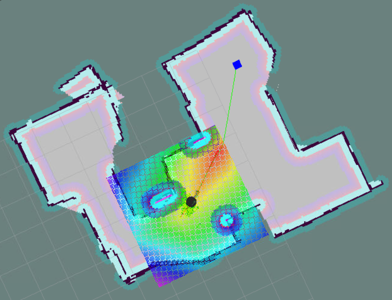

# Udacity Robotics Software Engineer Nanodegree
# Home Service Robot Project
### Sebastian Castro, 2019

## Setup
* Clone this repository into the `src` folder of a valid Catkin workspace
* Install any necessary ROS dependencies (this project uses ROS Kinetic)
* Ensure to source the Catkin workspace `source PATH_TO_CATKIN_WS/devel/setup.bash`
* Make the Catkin workspace using `catkin_make`
* Use any of the shell scripts described below

## Shell Scripts
These shell scripts are all found under the `ShellScripts` folder and relate to various progress checkpoints in the project. In order, these are as follows.
* `launch.sh` : Simple test script that starts Gazebo and Rviz
* `test_slam.sh` : Spawns robot in a simple world to test teleoperated SLAM
* `wall_follower.sh` : Spawns robot in the world with the wall follower node to automatically map the environment
* `test_navigation.sh` : Spawns robot in the world with a presaved map, user can test navigation using the "2D Nav Goal" cursor in Rviz
* `pick_objects.sh` : Spawns robot in the world and autonomously navigates to two locations
* `add_marker_test.sh` : Spawns robot in the world and checks that a marker can be added or removed. User must first manually add a marker in RViz.
* `add_marker.sh` : Spawns robot in the world, using a presaved RViz configuration with a marker. User can manually drive the robot to the marker and the marker should disappear and reappear at the pickup location
* `home_service.sh` : Spawns robot in the world, using a presaved RViz configuration with a marker. Autonomously navigates to pickup and dropoff locations, with the markers also updating automatically